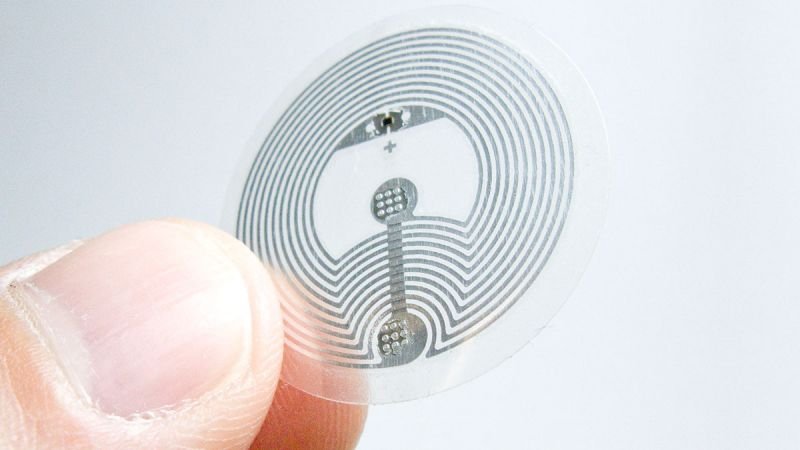
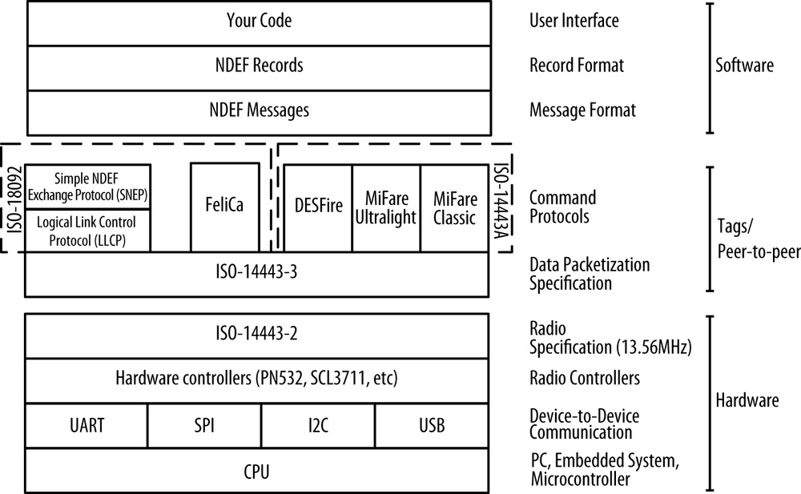

# NFC cold wallet for Kusama

## Project Description
The aim of this project is to build a solution for storing wallet seed securely offline by using NFC tags and industry standard cryptography and encryption.

## Why NFC?

- NFC or Near-Field-Communication is a set of communication protocols for communication between two electronic devices over a distance of 4 cm or less.

- NFC is designed to build on RFID by enabling more complex exchanges between participants.

- NFC tags are passive devices, which means that they operate without a need of power supply of their own and are dependent on an active device to come into range before they are activated. (such as smartphones)

- All the new mobile phones are equipped with NFC readers today which makes them an ideal candidate for broader adoption.

## NFC architecture

## NFC DATA EXCHANGE FORMAT (NDEF)
Data exchanged between NFC devices and tags is formatted using the NFC Data Exchange Format (NDEF). NDEF is one of the key advancements that NFC adds to RFID. It's a common data format that operates across all NFC devices, regardless of the underlying tag or device technology. Every NDEF message contains one or more NDEF records. Each record has a particular record type, a unique ID, a length, and a payload of data.

## Some considerations before using NFC tags and choosing the right NFC
- Memory size required?
- Encryption - Choose a chip which allows encryption
- Data retention - Standard chips can have a lifespan of 10-15 years, but special chips can have a lifespan of up to 200 years.
- Password lock - By default NFC chips are rewritable, but can be set also to read-only mode (after data is written), also password-lock mode can be used if the data needs to be changed again in the future.
- Durability - NFC chips are waterproof, durable to heat, and shock resistant.

More details here: https://www.shopnfc.com/en/content/11-nfc-guide

## Core functionality (Milestone 1)
The proposed mobile app solution should be able to
- read seed data from NFC tag
- write seed data to NFC tag (if the tag is not read-only/locked)
- make the NFC tag read-only (the seed data can't be removed/updated after this operation)
- select passphrase to use to encrypt the seed data for the write operation
- *hot copy of the seed data on the mobile device (when the nfc tag is scanned hot and cold backup copy can be compared) - sync status

Payout: 1000 KSM
Duration: 6-8 weeks (after that should ready to submit to App Store and Google play store)

## Supported Platforms
- Android 
- iOS

## Example prototype (work in progress)
https://drive.google.com/file/d/1GdrwaBXNKQ5MHSyoOw8mZwTZG_or2azI/view

## Notes
Goal is to opensource the whole mobile app so it can be potentially maintained by the community.
Anyone could contribute or fork the code after initial launch.
New functionality, features and the future roadmap could be decided by a democratic governance approach.
